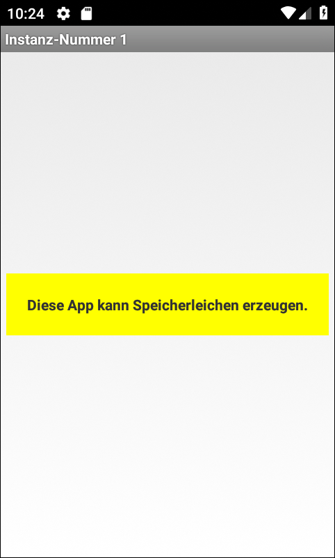
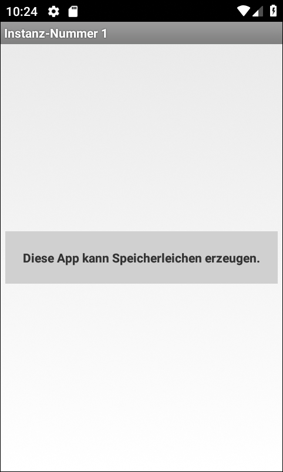

# Android-App "Speicherleichen"

Simple Android app for demonstration on how to find memory leaks. A thread is used for a blinker effect, but it is forgotten to stop this thread when the activity instance is destroyed.

 

Identifiers (names for classes, variables and methods), UI text and (JavaDoc) comments are in German only.

 

----
## Screenshots

  

 

The screenshots were taken from the app running in the Android SDK's emulator.

 

----
# License

See the [LICENSE file](LICENSE.md) for license rights and limitations (BSD 3-Clause License).
